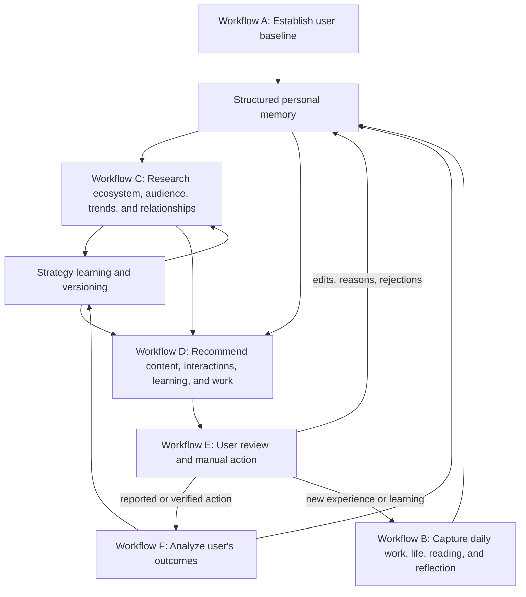

# Coordinating Workflow

## Product outcome

The product is a personal social media and career manager for a technical professional. It builds an accurate understanding of the user's work and personality, observes their niche, recommends useful public actions, and learns from real outcomes.

Its purpose is broader than writing posts. It should help the user:

- build a recognizable technical identity and consistent voice;
- demonstrate real skills through projects, explanations, and informed opinions;
- reach developers, maintainers, founders, recruiters, and DevRel communities;
- find appropriate job, collaboration, speaking, hackathon, and open-source opportunities;
- decide what to post, comment on, reply to, or repost with an opinion;
- decide what to read, learn, build, test, or contribute next;
- improve strategy from audience response without chasing vanity metrics or copying viral content.

## The three external apps

| App | Primary role | What the agent learns |
| --- | --- | --- |
| GitHub | Evidence of technical work | Projects, commits, pull requests, issues, documentation, languages, contribution patterns, and project evolution |
| X | Technical conversation and discovery | Short-form voice, public discussions, timely topics, visible interactions, relationship opportunities, and post performance |
| LinkedIn | Professional reputation and career context | Career story, professional posts, profile positioning, visible engagement, and professional audience response |

GitHub provides evidence; X and LinkedIn provide distribution, conversation, professional context, and feedback. No single app is treated as a complete representation of the user.

## End-to-end graph

The system contains six user-facing workflows and two shared systems:

- **A** creates the initial, evidence-backed model of the user.
- **B** captures changes that GitHub and social profiles cannot observe.
- **C** studies other people and the wider market.
- **D** decides what actions are worth recommending.
- **E** gives the user final editorial and execution control.
- **F** measures the user's own results.
- **M** stores structured, sourced, correctable memory.
- **S** manages hypotheses, experiments, and strategy versions.

Detailed specifications:

- [Workflow A — Establish the user baseline](workflows/A-user-baseline.md)
- [Workflow B — Capture daily life, work, and learning](workflows/B-daily-capture.md)
- [Workflow C — Research the ecosystem](workflows/C-ecosystem-research.md)
- [Workflow D — Recommend useful actions](workflows/D-recommendations.md)
- [Workflow E — User review and manual execution](workflows/E-review-and-execution.md)
- [Workflow F — Analyze the user's outcomes](workflows/F-outcome-analysis.md)
- [Structured personal memory](memory-system.md)
- [Strategy learning and versioning](strategy-learning.md)
- [Recommended technical stack](technical-stack.md)

## Shared objects passed between workflows

### User profile packet

Contains the user’s current goals, target audiences, credible skills, active projects, voice preferences, privacy rules, availability, and recent context. It is assembled from memory for a particular task instead of exposing the full memory store.

### Evidence record

Contains a claim, its source, date, confidence/status, visibility, and related records. Evidence may be observed, self-reported, user-confirmed, inferred, disputed, or superseded.

### Research packet

Contains current topics, audience questions, peer patterns, relationship context, comment and repost opportunities, relevant skill demand, source links, freshness, and uncertainty. It describes external observations, not conclusions about what will work for the user.

### Strategy hypothesis

Contains a testable belief, the audience and platform it concerns, its supporting observations, confidence, experiment design, comparison criteria, results, and current state. A hypothesis can be proposed, testing, supported, weakened, rejected, or retired.

### Recommendation card

Contains one proposed action, why it matters, which goal and audience it serves, the personal evidence behind it, timing, effort, risk, suggested draft or steps, and a clear review action.

### Action record

Tracks whether a recommendation was drafted, approved, edited, rejected, copied, reported as performed, verified through a URL or connected source, and later measured. Approval alone never means the action happened.

### Outcome record

Contains the measurement window, available metrics, visible audience signals, qualitative responses, relationship progress, comparison baseline, missing data, and interpretation.

## Normal operating rhythm

### Initial setup

Workflow A analyzes the user's current GitHub, X, and LinkedIn presence, then asks the user to confirm skills, goals, audience, boundaries, and voice. The result becomes the first profile and strategy baseline.

### Daily cycle

1. Workflow B checks observable project activity and asks what useful thing happened today.
2. Workflow C refreshes only time-sensitive research and expiring interaction opportunities.
3. Workflow D prepares a small prioritized brief.
4. Workflow E lets the user approve, edit, reject, postpone, or manually perform actions.
5. Completed actions are scheduled for later analysis in Workflow F.

The daily brief can include:

- one primary action, such as a post or substantial reply;
- up to a few timely interaction opportunities;
- one relationship action when there is genuine context;
- one small learning, building, or contribution suggestion;
- an explicit recommendation to skip posting when nothing is useful or credible.

This is a prioritization aid, not a posting quota.

### Weekly cycle

Workflow F compares the user’s recent actions with relevant historical baselines. The strategy system reviews experiments, updates supported tactics, identifies weak assumptions, and creates the next week's focus. The user sees the evidence behind every proposed change.

### Periodic profile refresh

Workflow A reruns relevant sections when goals, employment, major projects, skills, niche, audience, or public positioning change. It does not rebuild the entire identity from scratch for every minor update.

## Accuracy model

High accuracy means more than producing fluent text. The system uses five gates:

1. **Identity accuracy:** personal claims must be traced to source evidence or explicit confirmation.
2. **Context accuracy:** a comment or repost must reflect the original conversation and the user’s real position.
3. **Audience fit:** the action must serve a named audience and user goal.
4. **Freshness:** trends, events, opportunities, and platform behavior must include dates and expiry where relevant.
5. **Outcome honesty:** missing metrics, low sample sizes, and weak causal evidence must remain visible.

The agent must distinguish:

- lack of analytics from poor performance;
- no daily response from no activity;
- a reaction from proof of relationship or hiring interest;
- correlation from a causal explanation;
- a public trend from a topic the user should discuss;
- user expertise from a topic they are merely beginning to explore.

## Learning boundaries

Three kinds of learning remain separate:

- Writing preferences change from explicit feedback and repeated edits.
- Content strategy changes from repeated, comparable results and deliberate experiments.
- Career identity, goals, and values change only through explicit user decisions.

External research can propose a tactic. The user's results determine whether it fits them. One viral or weak post cannot permanently change the strategy.

## Relationship principles

The agent looks for legitimate ways to participate in ongoing conversations. It does not recommend repetitive engagement merely to appear in front of a famous person.

A useful relationship action needs:

- relevant prior or present context;
- something specific the user can add, ask, test, or clarify;
- a reasonable connection to the user's niche or goals;
- timing while the conversation remains active;
- no invented familiarity or hidden mass-outreach behavior.

Visible likes, reactions, comments, and reposts reveal some participants, but they do not identify every viewer. They are signals for relevance and follow-up, not proof of personal interest.

## First-version boundaries

- The user manually publishes posts, comments, replies, and reposts.
- The agent never fabricates work, reading, personal events, opinions, metrics, or relationships.
- Evidence such as a book-page photo or article link is optional and supports a claim; it does not prove full mastery or completion.
- The agent may recommend no action when quality, evidence, context, or timing is insufficient.
- No engagement farming, automated following, automated replies, bulk outreach, trend manipulation, or browser scraping is part of the product.
- Access methods and stored data must follow each platform's current permissions and retention rules. See [Platform boundaries](platform-boundaries.md).

The product can add more apps later. The reasons for the current three-app scope and deferred Instagram, design, workspace, blog, SEO/AEO, and media-outreach integrations are preserved in [Product decisions](product-decisions.md).

## Success measures

The system should optimize a balanced set of outcomes:

- credibility and factual correctness;
- engagement quality from the intended audience;
- useful conversations and repeat interactions;
- profile visits and relevant follower growth where measurable;
- project usage, contributions, collaboration, event, interview, or job outcomes;
- consistency without exhausting the user;
- lower edit and rejection rates while preserving the user's authentic voice;
- increased evidence of learning and building, not only increased posting.

Raw impressions and follower count remain supporting metrics. They do not replace career, relationship, learning, and credibility outcomes.
