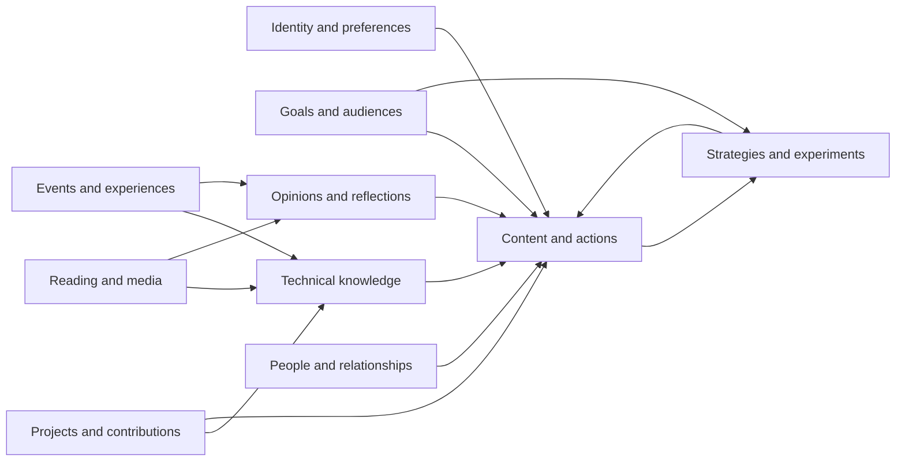

# Structured Personal Memory

## Purpose

The memory system gives the agent continuity without dumping every conversation, post, and activity into one unstructured profile. It stores small, typed, linked records with provenance, confidence, visibility, and version history.

The agent retrieves a focused memory packet for the current task. A post draft may need the user's voice, one project, a recent lesson, and a target audience. It does not need every hackathon, connection, and rejected draft.

## Memory graph

Links let the agent explain why a recommendation exists. For example, a suggested caching post may connect to a hackathon, an API latency problem, a page from a book, the user's own takeaway, a Redis experiment, and a measured result.

## Memory categories

### Identity and preferences

Store preferred name, pronouns if supplied, location or time zone when useful, languages, natural writing voice, vocabulary, formatting preferences, posting comfort, privacy boundaries, disliked behaviors, and availability.

Identity records should describe stable user-confirmed facts. The agent must not infer sensitive traits or transform stylistic observations into personality diagnoses.

### Goals and audiences

Store outcomes, priority, time horizon, success criteria, status, and target audiences. Examples include becoming known in a technical niche, finding a role, building founder relationships, becoming stronger at DevRel, attracting project contributors, or improving teaching skills.

Goals can conflict. The system should preserve tradeoffs instead of combining them into a vague goal such as “grow online.”

### Technical knowledge

Store concepts, tools, languages, frameworks, domains, and practices. Each record includes evidence and context:

- learned from a source;
- experimented with;
- applied in a project;
- used repeatedly;
- explained or taught;
- currently exploring;
- dormant;
- disputed or outdated.

Avoid universal labels such as “expert” when the evidence only supports one project.

### Projects and contributions

Store the problem, users, repository or artifact, role, collaborators, technologies, decisions, milestones, failures, outcomes, and related skills. Separate ownership from contribution and observed code from claimed impact.

### Reading and media

Store books, pages, papers, blogs, documentation, videos, podcasts, and talks. Link the source to passages or ideas, the user's notes, agreement or disagreement, questions, and intended application.

The status can distinguish saved, started, partially read, read, revisited, or abandoned. Evidence of one page does not imply completion of a book.

### Events and experiences

Store hackathons, meetups, conferences, interviews, classes, team discussions, incidents, demos, and personal technical experiences. Include the user's role, date, outcome, lessons, people involved, confidentiality, and possible public use.

### Opinions and reflections

Store the user's own position separately from source facts. Include topic, statement, reasoning, confidence, counterarguments, when it was expressed, and whether it is private or approved for public use.

Opinions can evolve. New versions supersede older versions without erasing the history that explains the change.

### People and relationships

Store a person only when they are relevant to the user's work, content, or goals and the data source permits it. Include how the user knows them, public context, prior interactions, shared interests, last meaningful interaction, and possible next step.

Use relationship states such as observed participant, one-time interaction, repeated interaction, known contact, collaborator, or user-confirmed relationship. A like, reaction, follow, or view never upgrades the relationship by itself.

Do not create covert dossiers, infer sensitive traits, or combine platform data in ways prohibited by its source.

### Content and actions

Store recommendations, drafts, versions, review decisions, user edits, feedback reasons, approved final text, performed status, URLs, measurement windows, and outcomes. Keep original posts, comments, replies, and reposts as distinct action types.

### Strategies and experiments

Store current strategy versions, content pillars, platform tactics, frequency ranges, audience priorities, relationship practices, hypotheses, tests, evidence, conclusions, and retired rules. See [Strategy learning](strategy-learning.md).

## Common record fields

Every durable record should support these fields conceptually:

| Field | Purpose |
| --- | --- |
| Owner | The user or entity the record concerns |
| Type and category | What kind of memory it is |
| Statement or description | The smallest useful fact, thought, event, or plan |
| Source | GitHub, X, LinkedIn, user conversation, uploaded evidence, URL, or derived analysis |
| Source reference | Stable link or identifier when allowed |
| Observed date | When the event or source content occurred |
| Captured date | When the system learned it |
| Status | Observed, self-reported, user-confirmed, inferred, disputed, or superseded |
| Confidence | Strength of support, kept separate from status |
| Visibility | Private, potentially shareable, or approved for public use |
| Sensitivity | Restrictions such as employer, interview, private project, personal, or third-party material |
| Validity window | Whether the record is current, expiring, or historical |
| Related records | Links to projects, skills, people, sources, content, goals, or experiments |
| Usage rules | Where the record may be used and whether confirmation is required |
| Retention rule | Source-specific storage or expiry requirement |
| Version history | Corrections, confirmations, disputes, merges, and superseding records |

## Evidence states

- **Observed:** directly obtained from an authorized or user-provided source.
- **Self-reported:** stated by the user without separate verification.
- **User-confirmed:** explicitly reviewed and confirmed by the user.
- **Inferred:** a reasoned interpretation that remains labeled as such.
- **Disputed:** contradicted by the user or another reliable source.
- **Superseded:** historically valid or previously believed, but replaced by a newer record.

Confidence and evidence state are independent. A high-confidence inference is still an inference.

## Visibility and publication

- **Private:** may support private planning but cannot appear in drafts.
- **Potentially shareable:** can inspire a recommendation, but public use requires review or confirmation.
- **Approved for public use:** may support drafts within its stated context.

Approval can be limited to one post or topic. Public information is not automatically appropriate for reuse in a new context.

## Write flow

1. Break an input into small candidate records.
2. Classify each record and identify its owner and source.
3. Separate facts, user opinions, agent inferences, plans, and completed outcomes.
4. Look for an existing record that should be linked, updated, disputed, or superseded.
5. Apply visibility, sensitivity, retention, and usage rules from both the user and source platform.
6. Ask the user only about material ambiguity or claims needed for an upcoming action.
7. Preserve provenance and version history.

## Retrieval strategy

The agent creates a task-specific packet using:

- the task and action type;
- platform and intended audience;
- relevant user goal;
- current time window;
- involved projects, topics, and people;
- evidence and visibility requirements;
- active strategy hypothesis.

Examples:

- A LinkedIn project retrospective retrieves the project, verified role, decisions, outcomes, relevant skills, professional voice, target audience, and LinkedIn strategy.
- A reply on X retrieves the original conversation, the user's related experience or question, prior interactions with participants, X voice preferences, and expiry.
- A learning suggestion retrieves goal gaps, active project needs, recent reading, available time, and market evidence.

Retrieval should favor current, user-confirmed, directly relevant records. It should include contradictory evidence when that contradiction affects the action.

## Conflict, correction, and deletion

When records conflict:

1. Keep both statements with their sources.
2. Prefer direct user correction for the user's identity, intent, experience, and opinion.
3. Prefer primary evidence for external facts.
4. Mark the older or weaker record as disputed or superseded instead of silently rewriting history.
5. Re-check drafts and strategies that depended on the changed record.

The user must be able to view memory by category, correct it, merge duplicates, change visibility, hide it from recommendations, or delete it. Deletion should also remove or invalidate derived records when the source rules or user request require that.

## Freshness and forgetting

Not every memory remains active forever:

- temporary trends and opportunities expire;
- current job-search status and availability require periodic confirmation;
- technical skills may become dormant rather than disappear;
- old writing preferences can be weakened by newer repeated feedback;
- relationship context loses urgency but remains historical when permitted;
- platform-sourced data follows platform-specific retention requirements.

The system should retain a compact stable profile and retrieve recent details as needed, instead of permanently placing all historical content into every prompt.

## User-facing controls

The memory interface should provide filters for:

- identity and preferences;
- goals and audiences;
- technology and skills;
- projects and contributions;
- reading and media;
- hackathons, events, and experiences;
- opinions and reflections;
- people and relationships;
- content and feedback;
- strategy and experiments.

Each record should show why the agent believes it, where it came from, whether it may be used publicly, and which recommendations or strategies depend on it.

## Non-negotiable rules

- Do not use one unstructured biography as the memory model.
- Do not convert an agent inference into a user fact.
- Do not use private material in a public draft without permission.
- Do not store restricted platform data longer or use it more broadly than allowed.
- Do not treat a platform-derived record as unrestricted simply because it was summarized.
- User-confirmed content may become an independent user-supplied record only when the user actually supplies or confirms the underlying information and source restrictions are respected.
- The user's corrections override stylistic or identity guesses made by the agent.
