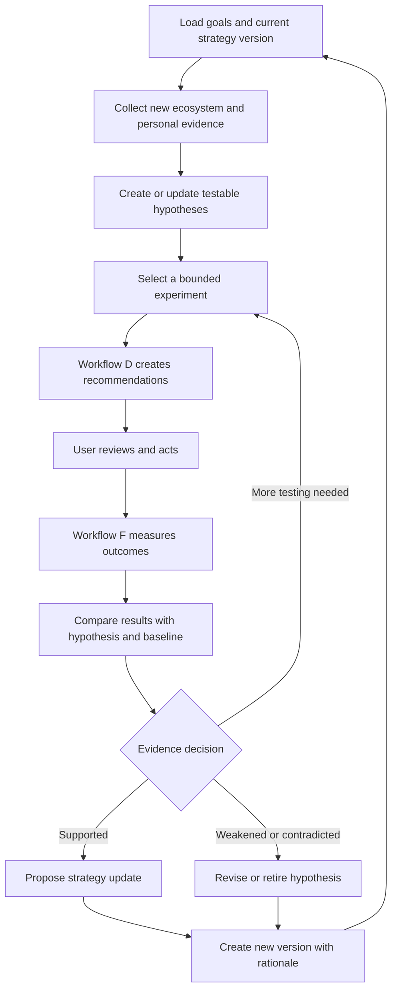

# Strategy Learning and Versioning

## Purpose

The strategy system coordinates Workflow C's external research with Workflow F's analysis of the user's own results. It turns observations into hypotheses, runs controlled experiments, and updates recommendations without overfitting to noise.

## Two evidence streams

### Ecosystem evidence from Workflow C

This shows what other people discuss, what audiences need, which formats appear useful, who participates, which conversations are active, and what skills or projects are in demand. It suggests opportunities and hypotheses.

### Personal evidence from Workflow F

This shows how the user's own posts, comments, replies, reposts, relationship actions, projects, and career actions performed. It determines whether an external pattern fits this user.

The agent must never use external popularity alone as proof that a tactic will work for the user.

## Strategy graph

## Three separate learning lanes

### 1. Writing preferences

Learn from explicit feedback and repeated edits: tone, sentence rhythm, technical depth, level of polish, openings, formatting, vocabulary, humor, and calls to action.

An edit can apply to one draft, similar drafts, or general preferences. Repeated changes may trigger a proposed preference, but the user confirms durable identity-level rules.

### 2. Content and interaction strategy

Learn from comparable outcomes across topics, platforms, formats, audiences, timing, comments, replies, reposts, and relationship actions. This lane can change more often, but every change needs evidence and an explanation.

### 3. Career identity and goals

The user's niche, desired role, values, target audience, and public identity change only through explicit user decisions. High engagement on an unrelated topic is not permission to reposition the user.

## Strategy version contents

Each version contains:

- primary goals and audiences;
- active niche and positioning statement;
- content pillars and their purpose;
- platform roles for GitHub, X, and LinkedIn;
- recommended action mix and sustainable pace;
- voice and evidence requirements;
- relationship approach;
- current learning and building priorities;
- active, paused, and retired hypotheses;
- excluded tactics and privacy limits;
- start date, author, rationale, and previous version;
- review date and conditions that should trigger early review.

## Hypothesis record

Every hypothesis should state:

- the observation that motivated it;
- target platform and audience;
- proposed action or content pattern;
- expected outcome and why;
- personal evidence or capability required;
- relevant external sources;
- comparison baseline;
- measurement window;
- success, failure, and inconclusive criteria;
- confounding factors;
- confidence and current state.

Example:

> For backend developers and early-stage technical founders on X, short posts explaining one measured tradeoff from the user's active project will produce more relevant technical replies than generic tool summaries.

This can be tested with several comparable posts. It should not be adopted permanently after one strong result.

## Hypothesis states

- **Proposed:** reasonable idea without a completed personal test.
- **Testing:** currently represented by one or more scheduled or performed actions.
- **Supported:** repeated comparable evidence favors it.
- **Weakened:** evidence is below expectation but not decisive.
- **Contradicted:** repeated evidence runs against it.
- **Inconclusive:** measurement or comparison is insufficient.
- **Paused:** relevant but not currently worth testing.
- **Retired:** no longer relevant, ethical, permitted, or useful.

## Experiment design

A good experiment changes one meaningful factor where practical, such as:

- concrete project evidence versus generic explanation;
- concise post versus deeper thread;
- practical example versus abstract opinion;
- direct comment versus quote post;
- beginner audience versus experienced practitioner audience;
- technical lesson versus build retrospective.

Experiments should remain natural. The user should not publish weak content merely to complete a test. Small accounts and sparse data require longer observation and more qualitative evidence.

## Evidence evaluation

The strategy review considers:

- enough comparable actions to reduce chance variation;
- quality of responses from the intended audience;
- reach and engagement where definitions are consistent;
- profile, project, link, follower, relationship, and career outcomes;
- user effort and satisfaction;
- edits and rejections;
- outside amplification or unusual timing;
- missing or expired analytics;
- whether the recommendation was actually performed as planned.

Qualitative evidence can outweigh raw counts. One thoughtful maintainer conversation may matter more than many irrelevant likes.

## Relationship strategy

Track useful participation rather than interaction quotas. Strategy may test whether the user gains better conversations by sharing implementations, asking precise questions, contributing documentation, or following up with results.

Do not optimize for repeated visibility in front of famous users without substance. Recommend a follow-up only when the user has new value or a legitimate reason to continue the conversation.

## Updating the strategy

1. Summarize new evidence and its limits.
2. State which hypothesis it affects.
3. Propose the smallest strategy change.
4. Show expected benefit and possible downside.
5. Preserve the previous version and rationale.
6. Apply changes automatically only within user-approved tactical bounds.
7. Ask the user to confirm changes to identity, goals, values, privacy, or durable voice rules.

## Failure prevention

- Do not learn from recommendations that were approved but never performed.
- Do not punish a content type when analytics are missing.
- Do not use unlike posts as a clean comparison.
- Do not copy a peer strategy without validating user fit.
- Do not optimize only for reach or follower count.
- Do not confuse frequent interaction with a strong relationship.
- Do not turn short-lived trends into permanent content pillars.
- Do not allow an AI-generated interpretation of the user's identity to override the user.

## Strategy review output

- current strategy version and change history;
- evidence dashboard with known limitations;
- supported, weakened, and inconclusive hypotheses;
- next experiments and why they are worth running;
- tactics to continue, change, pause, or retire;
- user decisions needed for goal, identity, privacy, or voice changes;
- research questions sent back to Workflow C;
- recommendation constraints sent to Workflow D.
