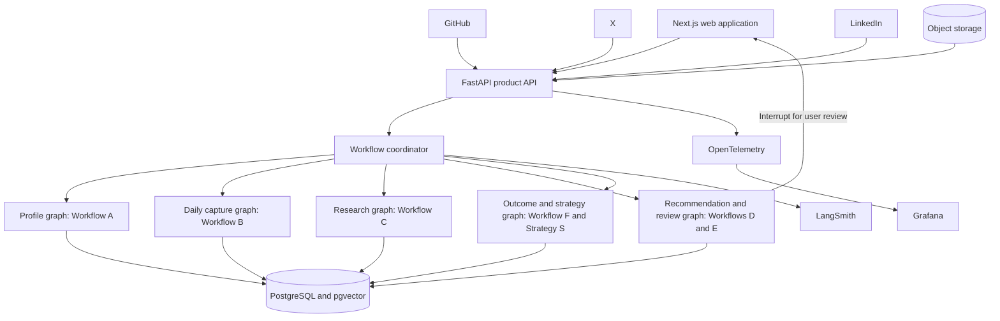

# Recommended Technical Stack

Last reviewed: 2026-09-13.

This document describes the recommended implementation stack for the AI social media manager defined in the [coordinating workflow](00-coordinating-workflow.md). It remains a technical direction rather than a commitment to exact vendors or deployment plans. Versions, pricing, API access, and platform requirements must be checked during implementation.

## Core recommendation

Use **LangGraph with Python** as the agent orchestration layer.

LangGraph fits this product because the workflows are long-running, stateful, cyclical, and dependent on human review. The important capabilities are:

- durable execution across failures and long pauses;
- saved checkpoints and resumable threads;
- branching and explicit state transitions;
- human-in-the-loop interrupts;
- scheduled and event-triggered runs;
- short-term workflow state and long-term memory integration;
- traceable execution paths.

The presence of a visual graph is not by itself the reason to choose LangGraph. Its execution and persistence model matches the product's approval, memory, research, analytics, and strategy-learning loops.

Official references:

- [LangGraph overview](https://docs.langchain.com/oss/python/langgraph/overview)
- [LangGraph persistence](https://docs.langchain.com/oss/python/langgraph/persistence)
- [LangChain human-in-the-loop](https://docs.langchain.com/oss/python/langchain/human-in-the-loop)

## Recommended stack

| Layer | Technology | Responsibility |
| --- | --- | --- |
| Web application | Next.js and TypeScript | User interface, authenticated application shell, and server-rendered product pages |
| UI system | Tailwind CSS and shadcn/ui | Daily check-in, recommendation cards, review controls, memory explorer, and analytics views |
| Product API | FastAPI and Pydantic | Application endpoints, OAuth callbacks, webhooks, uploads, validation, and connector coordination |
| Agent orchestration | LangGraph for Python | Workflows A–F, branching, retries, checkpoints, interrupts, and resumable execution |
| Agent runtime | LangGraph Agent Server | Assistants, threads, runs, cron jobs, task queue, and graph persistence |
| Primary database | PostgreSQL | Users, permissions, memory, evidence, relationships, actions, metrics, and strategy versions |
| Semantic retrieval | pgvector in PostgreSQL | Similarity search across relevant memories, projects, experiences, and prior content |
| File storage | S3-compatible object storage | Book-page photos, screenshots, résumés, exports, presentations, and other evidence files |
| Agent observability | LangSmith | LLM and graph traces, tool calls, evaluation, feedback, tokens, cost, latency, and errors |
| Application observability | OpenTelemetry and Grafana | API, database, connector, scheduler, worker, infrastructure, log, metric, and alert monitoring |
| Backend quality | pytest, Ruff, and mypy | Behavior tests, integration tests, formatting and lint rules, and static type checking |
| AI quality | LangSmith evaluation datasets | Offline regression tests, production sampling, human review, and strategy-quality checks |
| Packaging and deployment | Docker and managed services | Reproducible services, independent scaling, and environment isolation |

## Logical system layout

## Graph organization

Do not implement the product as one enormous LangGraph. Use bounded graphs and subgraphs that share typed records through the coordinator and database.

### Profile graph

Implements [Workflow A](workflows/A-user-baseline.md):

- confirm account ownership and permitted sources;
- analyze GitHub, X, LinkedIn, and user-provided material;
- construct the software journey;
- extract evidence-backed projects and skills;
- analyze current voice and positioning;
- interrupt for user confirmation;
- write the confirmed baseline to structured memory.

This graph runs during onboarding and refreshes affected sections after significant user changes.

### Daily-capture graph

Implements [Workflow B](workflows/B-daily-capture.md):

- check permitted recent activity;
- ask what useful happened today;
- collect optional evidence and reflection;
- separate facts, opinions, questions, and future actions;
- write linked memory records;
- create content, learning, building, or follow-up candidates.

This is a short user-driven graph. Lack of a response must not be stored as lack of activity.

### Research graph

Implements [Workflow C](workflows/C-ecosystem-research.md):

- load current goals, audiences, watch groups, and strategy;
- collect permitted external material;
- assess source freshness and coverage;
- identify relevant trends, audience questions, peer patterns, and opportunity gaps;
- find contextual comment, reply, repost, relationship, learning, contribution, and career opportunities;
- form testable strategy hypotheses;
- produce a sourced research packet.

Research should run on focused schedules and events rather than continuously crawling platforms.

### Recommendation and review graph

Combines [Workflow D](workflows/D-recommendations.md) and [Workflow E](workflows/E-review-and-execution.md):

- retrieve a task-specific memory packet;
- combine personal evidence, current research, and active strategy;
- generate candidates across supported action types;
- apply truth, privacy, relevance, timing, and platform gates;
- rank and draft a manageable set of recommendation cards;
- interrupt execution for user review;
- resume with approve, edit, reject, or later;
- capture feedback reasons and their selected scope;
- record manual execution separately from approval;
- schedule measurement only after the action is reported or verified as performed.

Workflows D and E should share a graph because LangGraph can save state at the review interrupt and resume the same run after the user's decision.

### Outcome and strategy graph

Implements [Workflow F](workflows/F-outcome-analysis.md) and [strategy learning](strategy-learning.md):

- schedule suitable measurement windows;
- collect permitted quantitative and qualitative outcomes;
- normalize platform, action type, audience, age, and format;
- compare with relevant historical baselines;
- evaluate active hypotheses and alternative explanations;
- propose the smallest supported strategy update;
- version the strategy and trigger appropriate future research or recommendations.

Longer career and relationship outcomes can resume this graph weeks after the original action.

## Coordinator responsibilities

The coordinator should manage events and graph transitions rather than doing content reasoning itself.

Useful domain events include:

- `profile_baseline_confirmed`;
- `daily_capture_completed`;
- `research_packet_ready`;
- `recommendation_ready_for_review`;
- `recommendation_approved`;
- `recommendation_edited`;
- `recommendation_rejected`;
- `action_reported_performed`;
- `action_verified_performed`;
- `measurement_due`;
- `outcome_analyzed`;
- `strategy_update_proposed`;
- `strategy_version_activated`.

Each event should contain stable internal identifiers and minimal metadata. Large raw platform payloads and private documents should remain in their governed storage locations.

## Agent state design

Use typed Pydantic models for every graph input, node output, event, and interrupt payload. A graph state should carry references to durable data instead of repeatedly copying the entire user profile or raw platform history.

Common state fields include:

- run, thread, user, and workflow identifiers;
- current node and status;
- triggering event;
- user goal and intended audience;
- platform and action type;
- retrieved memory and evidence identifiers;
- research packet and strategy version identifiers;
- draft and recommendation identifiers;
- validation results and unresolved questions;
- review decision and feedback scope;
- retry, expiry, and measurement timestamps.

The database remains authoritative for durable product records. LangGraph checkpoints preserve execution state and resumability; they should not become a second uncontrolled copy of the entire memory store.

## Database and memory design

Use PostgreSQL as the source of truth for the [structured memory system](memory-system.md). Store categories, provenance, visibility, confidence, retention, relationships, versions, and action states in ordinary relational tables.

Use pgvector only for semantic retrieval fields such as:

- memory statement embeddings;
- project and experience summaries;
- reading notes and reflections;
- prior drafts and approved final content;
- audience questions and research insights.

Retrieval should be hybrid:

1. Apply deterministic filters for user, permission, source, retention, visibility, platform, category, and time.
2. Use relational links for directly connected projects, people, goals, and evidence.
3. Use vector similarity for conceptually relevant records that were not directly linked.
4. Rerank by recency, evidence quality, relevance, and current strategy.

This avoids treating the memory system as a vector dump. pgvector keeps similarity search beside relational data and PostgreSQL transactions. See the [official pgvector repository](https://github.com/pgvector/pgvector).

## Model strategy

Use model roles rather than sending every task to the most capable and expensive model.

### Reasoning and synthesis model

Use a capable model for:

- onboarding synthesis;
- strategy reasoning;
- external research synthesis;
- nuanced recommendation ranking;
- sensitive relationship or career recommendations;
- final content drafting and verification.

### Smaller extraction model

Use a faster, lower-cost model for:

- classifying daily updates;
- extracting candidate memory records;
- tagging topics and action types;
- normalizing public content into a common schema;
- generating embeddings or search queries;
- routing work to graph branches.

### Deterministic application logic

Do not delegate these decisions solely to an LLM:

- authorization and platform permissions;
- action-state transitions;
- privacy and retention enforcement;
- metric calculations and normalization;
- deduplication and idempotency;
- scheduling and retries;
- whether an action was actually performed;
- source ownership and evidence presence;
- maximum workload and rate limits.

### Provider boundary

Place model calls behind a small internal interface so individual nodes can change provider or model without changing workflow state. Store the provider, model, prompt version, structured-output schema, cost, and latency with each run.

## External connectors

Use official platform authorization and data interfaces described in [platform boundaries](platform-boundaries.md).

### GitHub

Prefer a read-only GitHub App with repository-specific permissions. Use webhooks for meaningful updates when appropriate, with periodic reconciliation for missed events.

### X

Use approved X API access and user authorization for permitted profile, post, search, and analytics capabilities. Do not script the website. The user manually performs posts and interactions in the first version.

### LinkedIn

Use only approved LinkedIn APIs and permissions. Where access is unavailable, accept user-provided exports, links, screenshots, and manual reporting. Do not scrape or automate the website, and keep LinkedIn member-data restrictions attached to raw and derived records.

### Connector reliability

Every connector should support:

- encrypted token storage and rotation;
- minimum necessary scopes;
- explicit connection status;
- rate-limit and quota awareness;
- retry with backoff for safe reads;
- idempotent webhook processing;
- cursor and last-successful-sync tracking;
- partial failure reporting;
- revocation and deletion handling;
- raw-source timestamps and freshness indicators.

## Scheduling and asynchronous work

Use LangGraph Agent Server's threads, task queue, cron jobs, and PostgreSQL-backed persistence for the first version. It deploys graphs with persistence and a task queue and supports core resources such as threads, runs, and cron jobs. See the [Agent Server documentation](https://docs.langchain.com/langsmith/agent-server).

Use scheduled runs for:

- daily capture prompts;
- focused research refreshes;
- expiring comment or repost opportunities;
- early and later outcome measurements;
- weekly strategy reviews;
- source-retention cleanup and token-health checks.

Do not add Celery, Kafka, or Temporal to the MVP unless a demonstrated reliability or throughput requirement cannot be handled cleanly by the selected LangGraph runtime. This keeps one system responsible for graph execution and resumability.

## Observability design

Use two coordinated layers:

1. **LangSmith** for the behavior and quality of the agent.
2. **OpenTelemetry with Grafana** for the health of the application and infrastructure.

### LangSmith

LangSmith should capture:

- graph and subgraph path;
- node inputs and outputs after redaction;
- model and prompt versions;
- tool and connector calls;
- retrieved memory and evidence identifiers;
- validation and grounding results;
- user-review interrupts and resume events;
- token usage, estimated cost, latency, and errors;
- platform, action type, audience, strategy version, and hypothesis;
- user feedback, edit categories, and rejection categories;
- offline and sampled online evaluation results.

LangSmith provides traces, dashboards, alerts, feedback collection, and offline and online evaluation workflows:

- [LangSmith observability](https://docs.langchain.com/langsmith/observability)
- [LangSmith dashboards](https://docs.langchain.com/langsmith/dashboards)
- [LangSmith evaluation](https://docs.langchain.com/langsmith/evaluation)

### OpenTelemetry and Grafana

OpenTelemetry should instrument:

- frontend-to-API requests;
- FastAPI routes;
- database calls;
- object-storage operations;
- connector requests and webhooks;
- scheduled jobs and worker execution;
- queue delays and graph invocation;
- authentication and authorization failures;
- infrastructure resources.

Send traces, metrics, and correlated logs to Grafana Cloud or an equivalent OpenTelemetry-compatible backend. OpenTelemetry provides a vendor-neutral telemetry foundation. See [What is OpenTelemetry?](https://opentelemetry.io/docs/what-is-opentelemetry/).

### Shared trace context

Propagate these identifiers across the frontend, API, graph, connector, and database layers:

- trace ID;
- user ID in a non-public internal form;
- workflow and graph run ID;
- recommendation and action ID;
- strategy version;
- connector operation ID.

This should let an engineer begin with a poor recommendation, failed sync, or missing metric and follow its complete path without searching unrelated logs.

## Observability dashboards

### Agent reliability

- workflow completion, failure, and retry rate;
- node latency by graph and model;
- interrupted runs and time waiting for review;
- resume success rate;
- structured-output validation failures;
- tool and connector error rate;
- scheduled jobs that are late, missed, or stuck.

### Agent cost and performance

- tokens and estimated cost by user, workflow, node, model, and platform;
- model latency and time to first result;
- cache or retrieval effectiveness;
- external API requests and rate-limit consumption;
- cost per approved and performed recommendation.

### Recommendation quality

- evidence and source-verification pass rate;
- unsupported-claim detection;
- recommendation approval, edit, rejection, postponement, and performed rates;
- edit and rejection reasons;
- approval-to-performance conversion;
- user-rated usefulness and voice fit;
- intended-audience response;
- strategy hypotheses supported, weakened, or inconclusive.

### Product outcomes

- time from new evidence to useful recommendation;
- useful conversations and repeated interactions;
- relevant profile, follower, project, collaboration, interview, or job outcomes when available;
- learning and building actions completed;
- user workload and recommendation fatigue;
- percentage of recommendations that expire unused.

## Alerts

Create alerts for:

- OAuth or connector authentication failures;
- sustained platform rate limiting;
- webhook verification failures;
- repeated graph retries or stuck runs;
- missed daily or measurement schedules;
- sudden token or model-cost increases;
- elevated structured-output failures;
- evidence or privacy validation failures;
- traces accidentally containing secrets or prohibited sensitive data;
- outcome jobs attempting to measure actions that were never performed.

## Observability privacy

Do not log:

- OAuth access or refresh tokens;
- private repository contents;
- raw private messages;
- full book-page images or personal documents;
- secrets, credentials, or unpublished employer information;
- unrestricted raw platform payloads;
- unnecessary personal or third-party profile data.

Use redaction before export, environment-specific trace projects, role-based access, controlled retention, and sampling for high-volume production traffic. Prefer internal identifiers and sanitized summaries over raw content. Deleting governed source material should also invalidate or delete trace data when required.

## Evaluation strategy

Observability reveals what happened; evaluation determines whether the result was good.

Build evaluation datasets from reviewed cases while respecting privacy and source rules:

- approved recommendations with final user edits;
- rejected recommendations and reasons;
- factual corrections;
- strong and weak research packets;
- privacy-sensitive examples;
- comments that add value versus generic engagement;
- reposts with a real stance versus repetition;
- cases with insufficient evidence;
- cases where recommending no action is correct.

Evaluate:

- factual grounding and citation correctness;
- use of only permitted memory;
- distinction between observed, self-reported, confirmed, and inferred information;
- voice fit without fabricated humanization;
- audience and goal relevance;
- usefulness and originality;
- privacy and platform compliance;
- correct action-state transitions;
- calibrated uncertainty;
- whether the agent avoids overlearning from weak outcomes.

Use deterministic evaluators where rules are exact, human review for subjective voice and usefulness, and carefully calibrated model-based evaluators for scalable qualitative checks.

## Deployment direction

### MVP

- Next.js frontend on a managed web platform.
- FastAPI and LangGraph services in Docker containers.
- Managed PostgreSQL with pgvector.
- Managed S3-compatible object storage.
- LangSmith Cloud for traces and evaluations.
- Managed Grafana or another OpenTelemetry backend for application telemetry.
- A secrets manager or cloud KMS for connector credentials.

### Later production scaling

- independently scale API, graph workers, research workers, and analytics workers;
- introduce read replicas or partitions only when measured database load requires them;
- introduce Redis only for a demonstrated caching, locking, or rate-limit coordination need;
- use an OpenTelemetry Collector for filtering, routing, and sampling telemetry;
- consider managed LangGraph deployment or self-hosted Agent Server according to privacy, cost, and operations requirements;
- retain the ability to change model and observability providers through internal interfaces and OpenTelemetry.

## Suggested implementation order

1. Establish PostgreSQL schemas for users, evidence, memory, actions, strategy, permissions, retention, and audit history.
2. Add authentication and the read-only GitHub connector.
3. Implement Workflow A and the user-confirmation interrupt.
4. Implement Workflow B and structured memory retrieval.
5. Implement Workflows D and E with recommendation cards and manual execution states.
6. Add focused X and LinkedIn connector capabilities permitted for the approved use case.
7. Implement Workflow C research packets and opportunity expiry.
8. Implement Workflow F outcome collection and strategy experiments.
9. Add broader deployment scaling only after observing real bottlenecks.

LangSmith traces, OpenTelemetry instrumentation, prompt and model versioning, and initial evaluation cases should begin with the first graph. Adding observability after every workflow is built would lose the evidence needed to improve the system safely.

## Final stack decision

The recommended first implementation is:

> **Next.js + TypeScript + FastAPI + LangGraph Agent Server + PostgreSQL/pgvector + S3-compatible storage + LangSmith + OpenTelemetry/Grafana**

This stack supports durable human-reviewed agent workflows, structured and semantic memory, official platform connectors, scheduled analysis, evidence-backed recommendations, controlled strategy learning, and end-to-end observability without adding unnecessary queueing or orchestration systems during the MVP.
