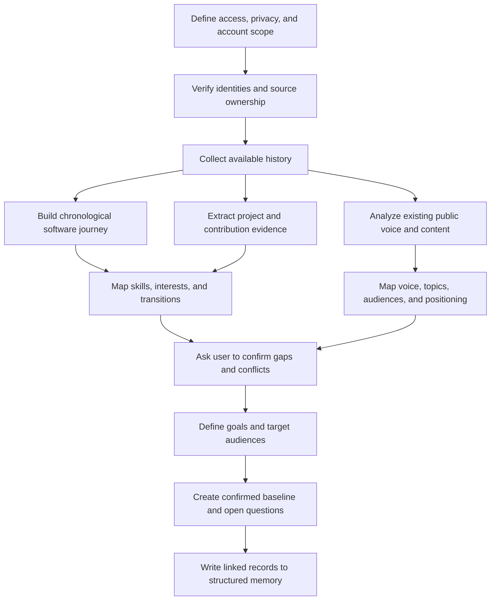

# Workflow A — Establish the User Baseline

## Purpose

Workflow A builds the first accurate model of the user before the agent recommends public actions. It reconstructs the user's software journey from connected and user-provided sources, then asks the user to verify conclusions that cannot safely be assumed.

## Inputs

- User-authorized GitHub account and selected repositories.
- User-authorized or user-supplied X profile, posts, and available analytics.
- User-authorized or user-supplied LinkedIn profile, posts, and available analytics.
- Portfolio, résumé, personal site, blog links, talks, project demos, or documents supplied by the user.
- A direct onboarding conversation about goals, interests, voice, privacy, and time.

## Node graph

## Detailed nodes

### A0 — Define access, privacy, and account scope

Record which accounts belong to the user, which repositories may be analyzed, whether private material is included, and which topics must never become public content. Ask for the minimum access needed.

### A1 — Verify identities and source ownership

Confirm that the connected GitHub, X, and LinkedIn identities represent the same user. Do not merge similarly named accounts or infer ownership from matching names alone.

### A2 — Collect available history

Collect only data available through permitted connected access, user exports, or user-provided links and files. Preserve source URLs, timestamps, and access method. Record missing periods rather than filling them with guesses.

### A3 — Build the chronological software journey

Create a timeline of learning, projects, roles, hackathons, communities, open-source work, talks, and major technical transitions. The timeline should show how the user's interests and capabilities evolved.

### A4 — Extract project and contribution evidence

For each meaningful GitHub project or contribution, identify:

- the problem and intended users;
- the user's actual role and contribution;
- technologies visibly used;
- architectural or implementation decisions visible in the work;
- issues, pull requests, documentation, releases, and maintenance activity;
- observable outcomes and unresolved questions;
- possible lessons worth confirming with the user.

Repository presence alone does not prove authorship, mastery, production use, or business impact. Forks, generated code, tutorial projects, team contributions, and abandoned experiments must be labeled accurately.

### A5 — Analyze existing public voice and content

Study the user's prior posts and professional writing for recurring topics, vocabulary, length, tone, storytelling style, level of technical detail, use of humor, calls to action, and comfort with personal disclosure. Separate observed style from an idealized brand voice.

### A6 — Map skills, interests, and transitions

Create candidate skill records backed by projects, contributions, roles, or user confirmation. Track skill level as contextual evidence rather than a universal score. A skill may be learned, practiced, applied, taught, dormant, or disputed.

### A7 — Map current positioning

Describe how a new visitor might currently understand the user on GitHub, X, and LinkedIn. Identify consistent signals, contradictions, missing proof, profile gaps, over-broad positioning, and strong existing themes.

### A8 — Confirm gaps and conflicts with the user

Ask focused questions when sources disagree or miss important work. Examples include private projects, offline work, internships, failed experiments, books, events, team contributions, career breaks, and reasons behind project choices.

### A9 — Define goals and target audiences

Record concrete outcomes and priorities, such as:

- become known for a particular technical niche;
- build relationships with founders or maintainers;
- obtain a role in a chosen area;
- grow DevRel skills through writing, demos, talks, and community support;
- attract collaborators or users for a project.

Define target audiences separately: practitioners, beginners, maintainers, founders, recruiters, DevRel professionals, communities, or prospective users. A recommendation may serve several groups, but it must name its primary audience.

### A10 — Create the confirmed baseline

Present the timeline, credible skills, active themes, voice description, goals, audiences, constraints, and unresolved questions to the user. Store confirmed items and retain uncertain conclusions with their status.

## Outputs

- Confirmed identity and connected-source map.
- Software journey timeline.
- Evidence-backed skill map.
- Project and contribution records.
- Existing-content and voice baseline.
- Goal and audience records.
- Privacy and publication boundaries.
- Profile improvement opportunities.
- Initial content pillars and strategy hypotheses.
- Explicit unknowns requiring future evidence or conversation.

## Completion criteria

Workflow A is complete enough to begin recommendations when the agent can answer:

- What does the user want to become known for?
- Which audiences matter, and why?
- Which skills and experiences can be claimed credibly?
- Which active projects or ideas can produce useful public material?
- How does the user naturally communicate?
- Which topics are private, uncertain, or off-limits?
- What important information is still missing?

## Refresh triggers

Refresh affected sections after a new role, major project, significant contribution, changed career goal, new niche, public profile rewrite, or explicit user correction. Minor daily activity flows through Workflow B instead.
