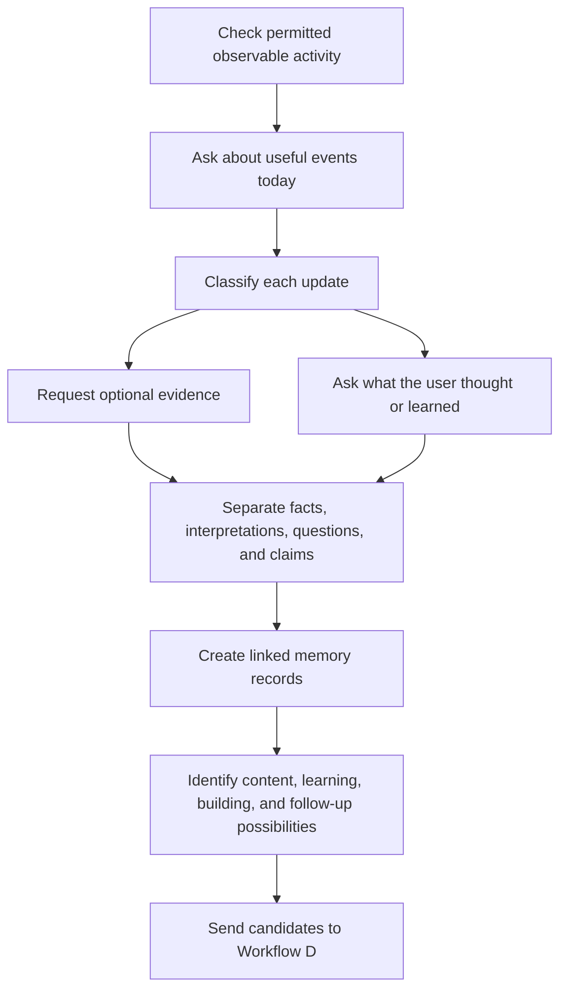

# Workflow B — Capture Daily Life, Work, and Learning

## Purpose

Workflow B captures useful experiences that connected apps cannot fully observe. GitHub can show a commit, but it usually cannot explain the user's struggle, decision, conversation, failed approach, book insight, hackathon experience, or changed opinion.

## Daily prompt

The default prompt is:

> What useful happened today? Did you read, build, discuss, try, fail at, discover, or change your mind about anything?

The user can answer freely. Silence means no information was captured; it does not mean nothing happened.

## Node graph



## Detailed nodes

### B1 — Check permitted observable activity

Review new activity from sources already authorized by the user, such as selected commits, pull requests, issues, releases, or previously reported posts. Produce prompts from the activity instead of immediately turning it into public content.

Examples:

- “You changed the caching layer today. What problem were you solving?”
- “This pull request was closed. What did the review teach you?”
- “You created a prototype but did not continue it. What failed?”

### B2 — Ask about useful events today

Invite updates beyond code:

- reading a book, paper, article, documentation, or discussion;
- attending a meetup, class, hackathon, interview, conference, or call;
- helping another developer or receiving useful feedback;
- making a technical decision or discovering a misconception;
- trying a tool, debugging a failure, or abandoning an approach;
- thinking about a market, product, career, or community problem;
- progress on private or offline work.

The interaction should feel like a short reflection, not a daily status report.

### B3 — Classify each update

Classify information into one or more linked categories:

- technical concept;
- project or contribution;
- reading or media;
- event or experience;
- opinion or reflection;
- relationship or conversation;
- career signal;
- question or uncertainty;
- achievement or outcome;
- preference or boundary.

### B4 — Request optional supporting material

When it helps accuracy, ask for a page photo, article or blog link, notes, project link, pull request, screenshot, presentation, event page, or demo. Evidence remains optional unless a public claim needs verification.

A page photo may support discussion of a particular passage. It does not prove the whole book was read or understood. A repository link may show code; it does not automatically prove sole authorship or production impact.

### B5 — Capture meaning and personal reaction

Ask a small number of follow-up questions:

- What did you learn?
- What surprised you?
- What do you disagree with?
- What changed in how you think?
- What will you try next?
- Who would find this useful?

This reflection is what lets the agent draft an authentic opinion rather than summarize a source generically.

### B6 — Separate information types

Store distinct statements for:

- **fact:** what happened or what a source says;
- **interpretation:** what the user thinks it means;
- **claim:** what might be stated publicly;
- **question:** what remains uncertain;
- **next action:** what the user intends to try.

Do not turn an inference into a fact or a plan into a completed action.

### B7 — Create linked memory records

Save each item in its proper category with source, date, status, visibility, and links to related projects, skills, people, or content. Do not append the entire conversation to one undifferentiated profile note.

Example linkage:

```text
Hackathon experience
  -> API latency problem
  -> article/book passage about caching
  -> user's caching takeaway
  -> Redis experiment
  -> measured result or unresolved question
  -> possible post or tutorial
```

### B8 — Identify possible uses

Mark items that could support:

- an immediate post;
- a later project update or retrospective;
- a useful comment on an active discussion;
- a repost with a personal interpretation;
- a deeper blog or thread;
- a learning task;
- a small build or experiment;
- a follow-up with someone involved;
- no public action, while retaining private learning.

Workflow B creates candidates. Workflow D decides whether any candidate is worth recommending now.

## Guardrails

- Never invent a productive day when the user has no update.
- Never pressure the user to provide proof for casual private reflection.
- Do not publish or imply sensitive details from work, interviews, private repositories, or personal conversations.
- Ask before converting potentially shareable material into public material.
- Respect uncertainty: “I started exploring” must not become “I mastered.”
- Keep failed attempts when the user allows it; they may be more useful than polished successes.

## Outputs

- Structured daily records with provenance and visibility.
- Confirmed facts and unresolved questions.
- New or updated links among projects, skills, reading, events, people, and opinions.
- Candidate content and interaction angles.
- Candidate learning, building, contribution, or follow-up actions.
- Privacy-sensitive items that must remain excluded from recommendations.
