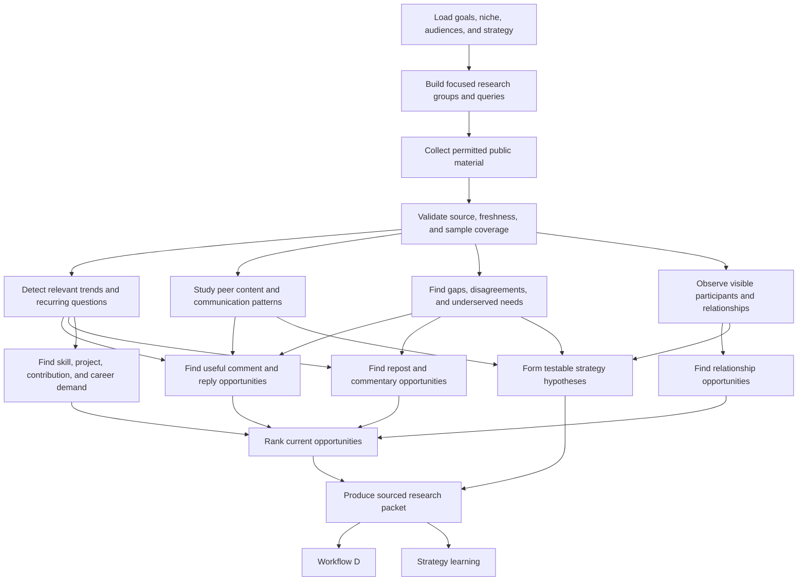

# Workflow C — Research the Ecosystem

## Purpose

Workflow C studies the outside world: what the target audience discusses, which questions remain unanswered, how credible peers communicate, where the user can contribute, and which technical or career opportunities are emerging.

It is deliberately separate from Workflow F. Workflow C analyzes **other people and the market**. Workflow F analyzes **the user's own actions and results**.

## Inputs

- User goals, niche, target audiences, skills, active projects, and relationship history.
- Current strategy version and open hypotheses.
- Permitted public material from X, LinkedIn, GitHub, technical blogs, project communities, documentation, and event or job sources.
- User-created watchlists and explicitly selected people, projects, communities, or topics.

## Node graph

## Detailed nodes

### C1 — Load the user's direction

Research starts from a named user goal and audience. “AI is trending” is not sufficient. A valid scope is more like “topics where early-stage AI infrastructure founders need practitioner insight and the user has relevant evidence or a realistic learning path.”

### C2 — Build focused research groups

Maintain separate watch groups:

- established specialists and educators in the niche;
- founders, maintainers, DevRel professionals, and community leaders relevant to the goal;
- existing followers or connections with relevant reach or expertise;
- peers and emerging builders at a similar stage;
- target companies, open-source projects, communities, conferences, and technical topics;
- people with whom the user has already had a meaningful interaction.

People can belong to several groups. Fame alone is never a selection criterion.

### C3 — Collect permitted public material

Collect current posts, discussions, project activity, documentation, and opportunity pages only through allowed sources and access methods. Retain the source, author, date, platform, query or watch group, and collection time.

### C4 — Validate research quality

Check:

- whether the source is original or repeating another source;
- whether the item is current enough for its purpose;
- whether the apparent pattern occurs across more than one post or person;
- whether engagement is visible and comparable;
- whether key context is missing;
- whether the source can legally and technically be stored or only used temporarily.

### C5 — Detect relevant trends

Identify rising tools, frameworks, debates, releases, recurring problems, vocabulary, events, and format changes. Every trend receives:

- a first-seen and last-checked date;
- evidence sources;
- audience relevance;
- maturity and likely lifespan;
- saturation level;
- relationship to the user's skills or active work;
- recommended stance: act, research, learn, observe, or ignore.

If the user lacks expertise, recommend learning, experimenting, or asking a good question instead of pretending authority.

### C6 — Study peer content patterns

Analyze patterns such as topic, format, opening, depth, specificity, examples, visual use, posting context, follow-up discussion, and audience response. Do not copy wording, anecdotes, structure mechanically, or treat raw popularity as proof of quality.

The output is a testable observation, such as: “For this audience, short build retrospectives with a concrete failure and fix appear to start more technical discussion than generic tool lists.”

### C7 — Find underserved audience needs

Look for repeated questions, incomplete explanations, weak documentation, unexplored tradeoffs, misconceptions, missing beginner bridges, missing examples, and places where existing posts receive corrections or requests for detail.

These gaps can generate content, documentation, demos, experiments, or open-source contributions.

### C8 — Observe visible participants

Where the platform permits it, note people who visibly comment, reply, react, like, quote, or repost. Use this to understand which audiences participate in a conversation and which accounts repeatedly interact.

Visible interactors are not the same as all viewers. An interaction does not prove friendship, endorsement, buying intent, or hiring intent.

### C9 — Find relationship opportunities

Evaluate opportunities with established people, relevant existing followers, peers, maintainers, founders, and potential collaborators. A relationship opportunity should have a concrete reason: shared technical problem, prior exchange, project overlap, useful answer, test result, thoughtful disagreement, or contribution.

The agent should favor consistent useful participation over a forced interaction quota. It should avoid repetitive comments on every post from a famous account.

### C10 — Find useful comment and reply opportunities

Each opportunity card contains:

- original post and conversation context;
- why it matches the user's knowledge, curiosity, or goals;
- what useful contribution the user can make;
- supporting personal evidence or an explicit knowledge gap;
- suggested comment or reply;
- relevant relationship history;
- timing and expiry;
- uncertainty or sensitivity flags.

Useful contributions include a concrete example, result, limitation, respectful counterpoint, clarifying question, resource, or follow-up experiment. Generic praise is not a strategy.

### C11 — Find repost and commentary opportunities

Recommend a repost or quote only when the user has a real stance: agreement with added evidence, disagreement with reasoning, a practical example, a missing tradeoff, or a question worth opening to their audience. Confirm the stance when it is not already known.

### C12 — Find skill, project, contribution, and career demand

Identify recurring demands visible in job descriptions, founder discussions, project roadmaps, issue trackers, community questions, and DevRel work. Translate them into bounded suggestions to read, learn, build, document, contribute, present, or apply.

The agent must explain why a suggestion supports the user's goal. It must not infer a hiring lead from prohibited prospecting data or a casual reaction.

### C13 — Form strategy hypotheses

Convert patterns into testable hypotheses with source evidence, target audience, platform, expected signal, and uncertainty. External observations propose hypotheses; they do not automatically rewrite the user's strategy.

### C14 — Rank current opportunities

Rank by audience relevance, personal fit, ability to add value, goal contribution, freshness, evidence strength, relationship context, effort, and risk of appearing generic or opportunistic.

### C15 — Produce the research packet

The packet contains:

- current relevant topics and their lifespan;
- audience questions and content gaps;
- peer-pattern observations;
- time-sensitive comment, reply, and repost opportunities;
- relationship opportunities with context;
- suggested learning, building, contribution, event, or career directions;
- proposed strategy hypotheses;
- source links, dates, coverage limits, and uncertainty.

## Research cadence

- Refresh expiring conversations and short-lived trends daily or when generating a brief.
- Review deeper audience needs, peer patterns, and relationship maps weekly.
- Review skill and opportunity demand periodically or after a goal change.
- Stop tracking topics, people, or communities that no longer serve the user's goals.

## Guardrails

- No scraping or browser automation that violates platform rules.
- No mass outreach, engagement farming, follower manipulation, or unsolicited repetitive replies.
- No automatic posting about trends.
- No copying another creator's distinctive expression.
- No sensitive-trait inference, surveillance, or hidden profile enrichment.
- No treating an outlier post as a dependable marketing rule.
- Every recommendation must remain useful even if the recipient never follows the user.

## Outputs

- Sourced research packet for Workflow D.
- Proposed hypotheses for the strategy system.
- Ranked, expiring interaction and relationship opportunities.
- Longer-lived audience needs and content themes.
- Learning, building, contribution, collaboration, and career opportunity signals.
- Explicit exclusions for irrelevant, saturated, unsupported, or unsafe topics.
