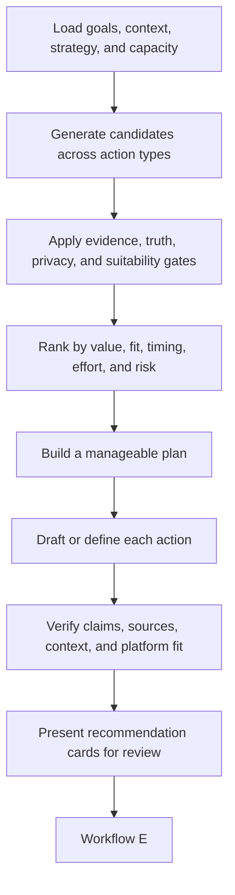

# Workflow D — Recommend Useful Actions

## Purpose

Workflow D converts the user's current context, ecosystem research, and strategy into a small set of worthwhile actions. It recommends more than posts: comments, replies, reposts with an opinion, relationship follow-ups, learning, building, open-source contributions, applications, collaborations, and deliberate rest.

## Inputs

- Task-specific user profile and memory packet.
- Recent daily captures and active projects.
- Current research packet from Workflow C.
- Active strategy version and experiments.
- Available time, desired pace, platform preferences, and privacy constraints.
- Unfinished or expiring recommendations.

## Node graph

## Detailed nodes

### D1 — Load current context and capacity

Retrieve only what is relevant to today's decision: user goals, audiences, recent experiences, credible expertise, active relationships, current experiments, time available, and recommendations already awaiting action.

### D2 — Generate candidates across action types

Generate candidates for:

- original X or LinkedIn posts;
- threads or longer professional explanations;
- comments and replies;
- reposts or quote posts with an opinion;
- relationship follow-ups;
- reading and learning;
- small builds, demos, experiments, or documentation;
- open-source issues or contributions;
- founder, maintainer, community, event, job, or collaboration approaches;
- profile or portfolio improvements;
- collecting more evidence before speaking;
- postponing or taking no public action.

Candidates can come from the user's real day, project history, unfinished thoughts, audience needs, current discussions, trends, or strategic gaps. If nothing new happened, the agent may still suggest an evergreen explanation, considered opinion, useful interaction, or learning task. It should never manufacture a personal story to fill the calendar.

### D3 — Apply evidence and suitability gates

Reject or revise a candidate when:

- the personal claim lacks evidence or confirmation;
- it exposes private, employer, interview, client, or third-party information;
- the user does not understand the topic well enough for the proposed stance;
- it misrepresents a project, team role, result, or source;
- the trend is irrelevant to the user's niche or audience;
- the comment adds no value to the conversation;
- the relationship action lacks genuine context;
- the source is stale, unreliable, or misunderstood;
- the wording copies another creator too closely;
- it conflicts with platform rules or user boundaries.

### D4 — Rank candidates

Rank using:

- contribution to the user's stated goal;
- value for the intended audience;
- strength of personal evidence;
- fit with the user's voice and niche;
- freshness and expiry;
- relationship value;
- learning or portfolio value;
- expected effort and user capacity;
- risk of being generic, repetitive, misleading, or intrusive;
- value of the information the experiment could produce.

Predicted reach is one input, not the primary objective.

### D5 — Build a manageable plan

Present a small brief rather than an endless feed of possible actions. A normal brief may contain one primary action, a few timely interactions, one relationship action, and one learning or building action. Reduce the brief when the user has little time.

### D6 — Draft or define each action

Every action type has its own recommendation contract.

#### Original post

- platform and intended audience;
- purpose and expected audience value;
- personal evidence or confirmed experience;
- topic, angle, and suggested format;
- draft in the user's voice;
- source links or media suggestions;
- factual, privacy, or timing warnings;
- optional variants only when they represent meaningful choices.

GitHub activity should become a story about the problem, decision, failure, result, or lesson rather than a raw commit summary.

#### Comment or reply

- original post and relevant conversation context;
- why the user is a good participant;
- the specific value to add;
- supporting experience, source, or honest knowledge gap;
- suggested comment or reply;
- relationship context and expiry.

#### Repost or quote post

- original source and its central claim;
- the user's confirmed or proposed stance;
- the distinct insight, example, question, or disagreement being added;
- suggested draft;
- whether a direct comment would be more useful than a repost.

#### Relationship follow-up

- person and prior context;
- legitimate reason to reconnect;
- useful next action, such as sharing a result, answering a question, thanking them specifically, testing their idea, or contributing to their project;
- no invented closeness or implied obligation.

#### Read or learn

- the question to answer;
- why it matters to the user's current goal or project;
- a credible source or learning route;
- a bounded time or scope;
- requested reflection or application;
- possible artifact, such as notes, an example, or a small explanation.

#### Build, test, document, or contribute

- the problem and intended outcome;
- connection to audience or career demand;
- bounded scope;
- existing project or community context;
- expected artifact;
- completion and evidence criteria;
- possible public story after real work is complete.

#### Career, founder, or collaboration opportunity

- source and freshness;
- why it fits the user's verified skills and goals;
- missing requirements or uncertainty;
- preparatory action, such as improving a project, writing a targeted explanation, or contributing first;
- suggested approach based on genuine relevance;
- no mass messaging or unsupported claim of mutual interest.

### D7 — Verify the recommendation

Before presentation, verify names, URLs, dates, quotes, technical facts, original conversation context, public claims, platform length and format, and evidence links. Mark anything that still depends on user confirmation.

### D8 — Present recommendation cards

Each card should make the decision easy:

- **Action:** what the user could do.
- **Why now:** timing and opportunity.
- **Goal and audience:** who it serves.
- **Evidence:** why the user can credibly do it.
- **Effort:** expected time and difficulty.
- **Draft or steps:** a usable starting point.
- **Risks or unknowns:** what needs care or confirmation.
- **Review controls:** approve, edit, reject, or later.

## Content balance

Recommendations should gradually cover credible content pillars such as:

- building in public and project progress;
- technical lessons and debugging stories;
- informed opinions and tradeoffs;
- teaching and documentation;
- open-source and community participation;
- learning journeys and experiments;
- product and developer-experience observations;
- career reflections that remain useful to the audience.

The mix follows user goals and results. It is not a fixed content calendar.

## Output

A prioritized set of recommendation cards ready for Workflow E. Every card must be independently reviewable and connected to evidence, goals, audience, and current strategy.
