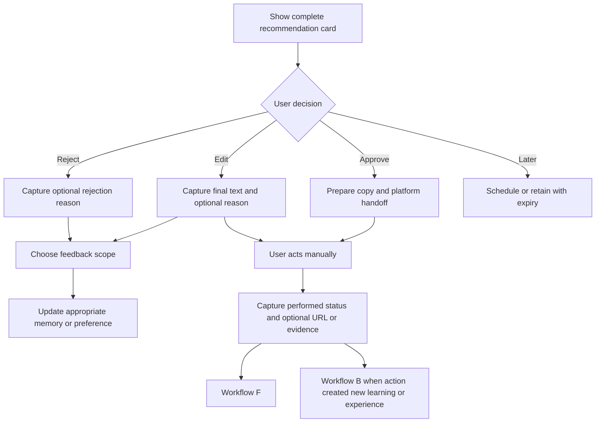

# Workflow E — User Review and Manual Execution

## Purpose

Workflow E preserves the user's authorship and control. The user reviews every proposed post, comment, reply, repost, relationship action, learning task, or career action. For social actions in the first version, the user performs the action manually on X or LinkedIn.

## Node graph

## Review states

The user can:

- **Approve:** the recommendation is acceptable as presented.
- **Edit:** the user changes wording, stance, scope, timing, or plan.
- **Reject:** the user does not want the recommendation.
- **Later:** the idea is useful but should be postponed.

Approval does not mark an action as performed.

## Editing flow

When the user edits a draft, show an optional box asking why. Suggested reasons include:

- sounds unlike me;
- too polished or formal;
- too generic;
- inaccurate or exaggerated;
- not my actual opinion;
- wrong audience or topic;
- poor timing;
- too personal or sensitive;
- clearer technical explanation;
- free-text reason.

The final user-edited content should be saved as the authoritative version. A text diff can help identify changes, but the reason explains whether the change reflects voice, facts, privacy, strategy, or simple preference.

“Humanizing” means learning the user's real rhythm, wording, level of confidence, and way of explaining. It must never mean inserting fake anecdotes, deliberate mistakes, false uncertainty, or artificial slang.

## Rejection flow

When a user rejects a recommendation, ask for an optional reason using the same categories plus:

- I do not want to interact with this person;
- I do not want to pursue this opportunity;
- this is not useful enough;
- I have already covered this;
- too much effort right now.

A rejection is evidence about this recommendation. It becomes a broader preference only when the user explicitly chooses that scope or a repeated pattern is confirmed.

## Feedback scope

After an edit or rejection, let the user decide whether the feedback applies to:

- this recommendation only;
- similar recommendations;
- a general writing or product preference.

The agent may suggest a broader inferred preference after repeated evidence, but the user confirms it before it becomes a durable rule.

## Manual execution

For approved social content:

1. Give the user clean copy, the original context link when needed, and any attachment or source reminders.
2. Open or identify the correct platform destination without submitting the content automatically.
3. The user posts, comments, replies, or reposts manually.
4. Ask the user to mark the action as done and optionally provide the public URL.
5. Where permitted connected access later confirms the URL or action, add verification separately.

For learning, building, contribution, application, or relationship actions, the user similarly marks progress and can attach evidence or reflection.

## Action-state model

Track these states separately:

- recommended;
- opened for review;
- approved;
- edited;
- rejected;
- postponed;
- copied or handed off;
- user-reported as performed;
- verified as performed;
- measurement scheduled;
- measured;
- cancelled or expired.

Never infer “posted” from approval or “completed” from opening a link.

## Learning from review

Review feedback routes to the right system:

- factual corrections update or dispute evidence records;
- voice and phrasing feedback updates writing preferences;
- privacy feedback updates publication boundaries;
- audience or topic feedback informs strategy hypotheses;
- career direction changes require explicit goal confirmation;
- new experience or reflection returns to Workflow B.

## Output

- Final approved or edited content and actions.
- Explicit rejection and postponement records.
- Scoped feedback with reasons.
- Accurate action status and optional URL or evidence.
- Measurement schedule for performed actions.
- New daily-life or learning information routed to Workflow B.
