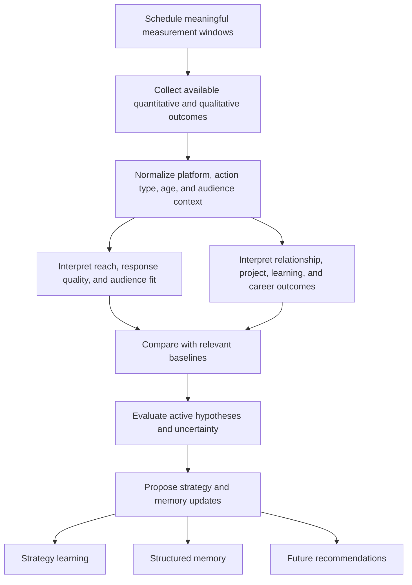

# Workflow F — Analyze the User's Outcomes

## Purpose

Workflow F studies the user's own posts, comments, replies, reposts, relationships, projects, and career actions. It determines what happened, what can reasonably be inferred, and which strategy hypotheses deserve another test or an update.

Workflow F does not research general trends or other creators; that belongs to Workflow C.

## Inputs

- Action records from Workflow E.
- Available connected analytics for the user's own content.
- Public counts and visible interactions where permitted.
- User-reported outcomes, URLs, screenshots, messages, conversations, interview progress, project results, or reflections.
- Comparable historical actions and the strategy hypothesis active when each action was recommended.

## Node graph

## Detailed nodes

### F1 — Schedule measurement windows

Measure after enough time has passed for the action and platform. Use configurable windows instead of assuming immediate performance is final. Capture time-sensitive private analytics before platform availability expires.

An action may need several checkpoints, such as an early discussion check and a later reach or relationship check. Career and collaboration outcomes may take weeks or months.

### F2 — Collect available outcomes

For original posts, collect available signals such as impressions, reach, reactions or likes, comments or replies, reposts or reshares, quote posts, saves, clicks, profile visits, follows, and visible participants.

For comments and replies, capture:

- reactions and replies to the user's contribution;
- whether the original author or relevant participant responded;
- whether a deeper technical conversation followed;
- profile or follower change where available;
- qualitative value of the exchange.

For reposts or quote posts, separate the performance of the user's commentary from totals belonging to the original post.

For relationship actions, capture continued conversation, reciprocal interaction, collaboration, introduction, project feedback, meeting, or no visible outcome. A single like is a weak interaction signal, not proof of a relationship.

For learning and building actions, capture completion, artifact, lesson, failed assumption, project improvement, and whether new credible content became possible.

For career or collaboration actions, capture application, response, conversation, interview, referral, contribution, acceptance, rejection, or unresolved status without inferring intent.

### F3 — Normalize the context

Comparisons should account for:

- X versus LinkedIn;
- original post, reply, comment, or repost;
- topic and content format;
- audience size at the time;
- day and age of the content;
- organic versus promoted distribution when known;
- whether a larger account amplified it;
- whether metrics are complete and defined consistently.

Do not compare raw totals across unlike platforms or action types.

### F4 — Interpret audience response

Ask:

- Did the intended audience appear among visible respondents?
- Did responses show understanding, curiosity, disagreement, or confusion?
- Did people ask useful follow-up questions?
- Did the action attract relevant practitioners, maintainers, founders, DevRel people, or recruiters?
- Was the discussion useful even if reach was modest?
- Did the content drive profile, project, or link activity where measurable?

Likes and reactions identify some interactors. They do not reveal everyone who viewed the content.

### F5 — Interpret non-content outcomes

Track whether recommendations helped the user learn, build stronger proof, improve a project, contribute publicly, begin a legitimate professional relationship, find an event, or progress toward a role. These may be more valuable than post reach.

### F6 — Compare with appropriate baselines

Compare like with like: similar action type, platform, audience, topic, format, account stage, and measurement window. Use several observations where possible and show when the sample is too small.

Useful comparisons include:

- quality and rate of relevant responses;
- conversation depth;
- profile or project actions per available reach;
- relevant follower change;
- edit effort and user satisfaction;
- relationship continuation;
- learning or portfolio artifacts completed.

### F7 — Evaluate hypotheses

For each active hypothesis, record whether the outcome supports, weakens, contradicts, or does not meaningfully test it. Consider alternative explanations such as amplification by another account, unusual news timing, missing analytics, or a stronger-than-normal topic.

One viral post starts a new experiment. It does not become a permanent rule. One weak result similarly does not kill a strategy when timing, execution, or measurement was poor.

### F8 — Propose updates

Produce:

- outcome summaries with evidence and missing data;
- supported and weakened hypotheses;
- recommended follow-up experiments;
- audience, relationship, skill, or project observations;
- proposed writing preference changes from repeated edits;
- factual memory corrections or newly verified achievements;
- next-step recommendations for Workflow D.

## Reporting language

Use calibrated conclusions:

- “Observed” for direct metrics or visible events.
- “User-reported” for outcomes supplied by the user but not independently verified.
- “Suggests” for a plausible pattern with limited evidence.
- “Supported across comparable actions” when repeated results exist.
- “Unknown” when data is unavailable.

Do not label missing analytics as failure, assume causality from correlation, or attribute a follower change to one post without evidence.

## Output

A transparent outcome report, updated experiment evidence, and carefully scoped proposals for memory and strategy. The user should be able to see what happened, what the agent inferred, and how certain that inference is.
